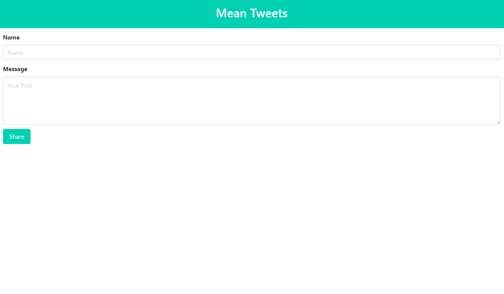

# Twitter Clone


### Table of Contents
- [Description](#description)
- [Installation](#installation)
- [Usage](#usage)
- [License](#license)
- [Preview](#preview)
- [Questions](#questions)

## Description
This project is a mock Twitter, where users can post a message and have it shown on the app. Users can delete and/or edit their messages. User's message are saved on a MySQL database and API request are made to the database to GET, POST, UPDATE, and DELETE messages.

Technologies Used:
- Bulma (CSS Framework)
- JS (ES6)
- Jquery
- node.js
- express.js
- express handlebars 
- mysql DB
- JAWS DB

## Installation
No installation required. If cloning, run 
```
npm install
```
in the respective directory then
```
node server
```
to try the app on your local machine.

## Usage
Visit the deployed site and leave a post!

## License
MIT License

## Preview 



## Questions
Feel Free to contact me for questions. 

GitHub: [eddyangang](https://github.com/eddyangang/TwiiterClone-)

Deployed Site: [Mean Tweets](https://agile-brook-94761.herokuapp.com/)